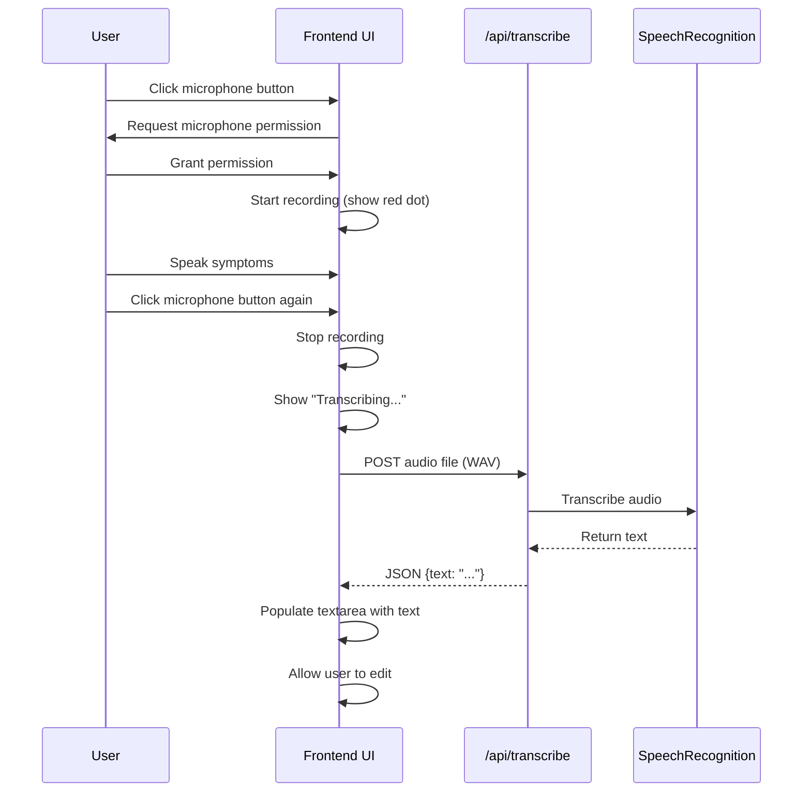
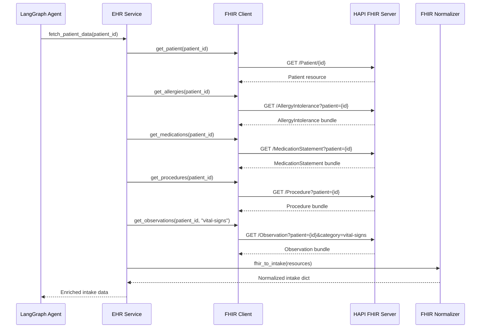
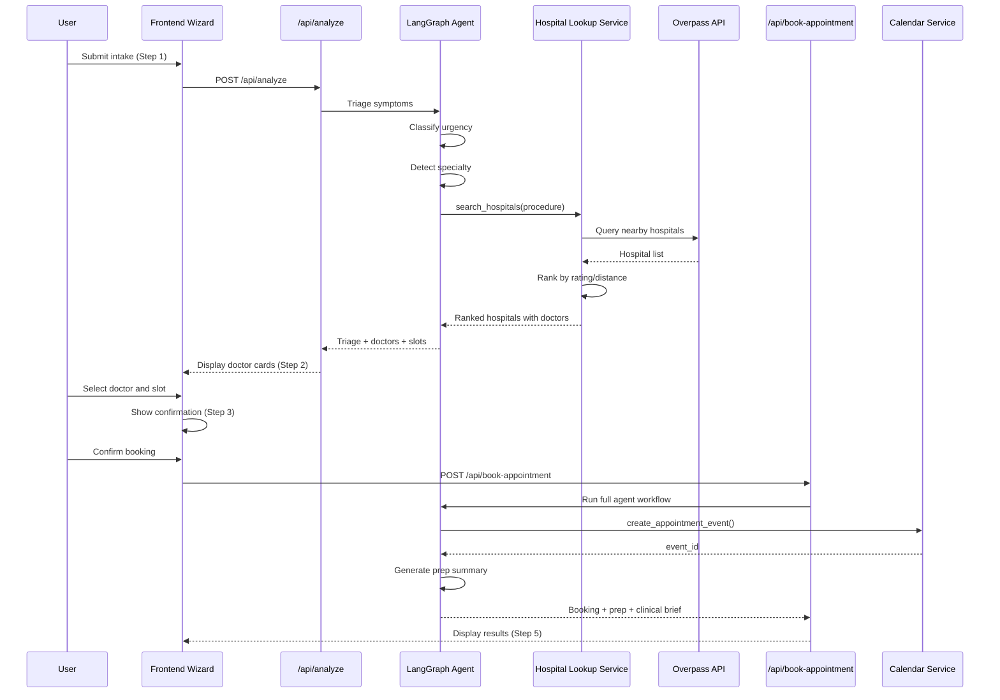
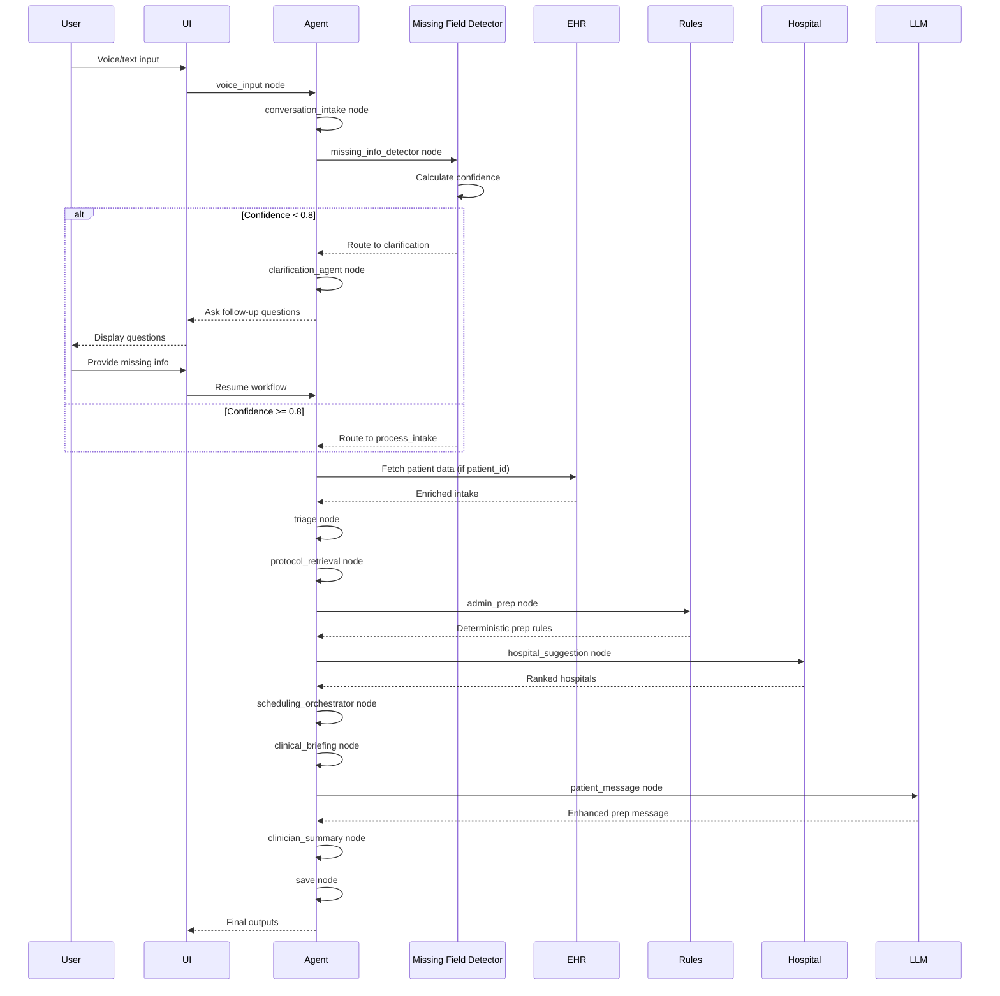

# Design Document: Agentic Upgrade Phase

## Overview

This design document specifies the architecture, components, and implementation details for upgrading the Hospital Pre-Appointment Management System from a linear pipeline to a true agentic workflow. The upgrade introduces voice input, EHR/FHIR integration, missing field detection, hospital lookup, enhanced scheduling, and conditional LangGraph flow while preserving the deterministic RulesEngine as the source of truth for medical instructions.

### System Goals

1. Enable natural voice-based patient intake using Web Speech API
2. Automatically enrich intake data with EHR/FHIR patient records
3. Detect missing required fields and intelligently prompt for completion
4. Suggest nearby hospitals and doctors based on procedure type and location
5. Orchestrate appointment scheduling with Google Calendar integration
6. Implement conditional LangGraph workflow with intelligent routing
7. Maintain backward compatibility with existing deterministic rules
8. Support mock mode for development without external API dependencies

### Key Design Principles

- **Deterministic Medical Rules**: RulesEngine remains the source of truth for all medical instructions (fasting, arrival times, prep requirements)
- **Graceful Degradation**: System continues to function when external services (FHIR, Overpass API, Google Calendar) are unavailable
- **Mock Mode First**: All external integrations support mock mode for development and testing
- **Conditional Routing**: LangGraph flow uses confidence scores and data completeness to route intelligently
- **State-Driven Architecture**: All workflow information tracked in AgentState for transparency and debugging

## Architecture

### High-Level Architecture


```mermaid
graph TB
    subgraph "Frontend Layer"
        UI[Agent Workspace UI]
        Voice[Voice Input Component]
        Wizard[5-Step Wizard]
    end
    
    subgraph "API Layer"
        Flask[Flask App]
        Transcribe[/api/transcribe]
        Analyze[/api/analyze]
        Book[/api/book-appointment]
        HospitalAPI[/api/hospital-lookup]
    end
    
    subgraph "Agent Layer - LangGraph"
        Entry[voice_input]
        ConvIntake[conversation_intake]
        MissingDetect[missing_info_detector]
        Clarify[clarification_agent]
        ProcessIntake[process_intake]
        Triage[triage]
        Protocol[protocol_retrieval]
        AdminPrep[admin_prep]
        Hospital[hospital_suggestion]
        Schedule[scheduling_orchestrator]
        Clinical[clinical_briefing]
        PatientMsg[patient_message]
        ClinicianSum[clinician_summary]
        Save[save]
    end
    
    subgraph "Service Layer"
        EHR[EHR Service]
        FHIR[FHIR Client]
        Normalizer[FHIR Normalizer]
        HospitalLookup[Hospital Lookup Service]
        Overpass[Overpass API]
        Nominatim[Nominatim API]
        Calendar[Calendar Service]
        Rules[RulesEngine]
        LLM[LLM Client]
        Storage[Storage Service]
    end
    
    UI --> Flask
    Voice --> Transcribe
    Wizard --> Analyze
    Wizard --> Book
    
    Flask --> Entry
    Entry --> ConvIntake
    ConvIntake --> MissingDetect
    MissingDetect -->|confidence < 0.8| Clarify
    MissingDetect -->|confidence >= 0.8| ProcessIntake
    ProcessIntake --> Triage
    Triage --> Protocol
    Protocol --> AdminPrep
    AdminPrep --> Hospital
    Hospital --> Schedule
    Schedule --> Clinical
    Clinical --> PatientMsg
    PatientMsg --> ClinicianSum
    ClinicianSum --> Save
    
    ProcessIntake --> EHR
    EHR --> FHIR
    FHIR --> Normalizer
    Hospital --> HospitalLookup
    HospitalLookup --> Overpass
    HospitalLookup --> Nominatim
    Schedule --> Calendar
    AdminPrep --> Rules
    PatientMsg --> LLM
    Save --> Storage
```

### Component Interactions


The system follows a layered architecture:

1. **Frontend Layer**: Agent Workspace UI with voice input and 5-step wizard
2. **API Layer**: Flask routes for transcription, analysis, booking, and hospital lookup
3. **Agent Layer**: LangGraph conditional workflow with 14 nodes
4. **Service Layer**: External integrations (EHR, Hospital Lookup, Calendar) and core services (Rules, LLM, Storage)

### Conditional LangGraph Flow

The agent uses conditional routing based on data completeness:

- **Voice Input Path**: If `input_mode == "voice"`, route through voice_input → conversation_intake
- **Missing Info Detection**: Calculate confidence score based on field completeness
- **Clarification Loop**: If confidence < 0.8, route to clarification_agent and END (wait for user response)
- **Complete Path**: If confidence >= 0.8, proceed through full workflow to save

### Data Flow

1. **Patient Input** → Voice/Text → Transcription → Conversational Intake
2. **Missing Field Detection** → Confidence Scoring → Clarification (if needed)
3. **EHR Enrichment** → FHIR Fetch → Normalization → Merge with Manual Data
4. **Triage** → Urgency Classification → Red Flag Detection
5. **Protocol Retrieval** → RAG Search → Clinic Protocols
6. **Admin Prep** → RulesEngine → Deterministic Instructions
7. **Hospital Suggestion** → Overpass API → Ranking by Rating/Distance
8. **Scheduling** → Google Calendar → Event Creation → Confirmation
9. **Clinical Briefing** → EHR Context → Risk Assessment
10. **Patient Message** → LLM Enhancement → Prep Summary
11. **Clinician Summary** → Structured Briefing
12. **Persistence** → SQLite Storage

## Components and Interfaces

### 1. Voice Input System

**Purpose**: Capture patient symptoms via voice using Web Speech API

**Interface**:
```python
class VoiceInputComponent:
    def request_microphone_permission() -> bool
    def start_recording() -> None
    def stop_recording() -> AudioBlob
    def send_to_transcription(audio: AudioBlob) -> str
```

**Frontend Implementation**:
- Microphone button with recording indicator
- Visual feedback (pulsing red dot during recording)
- Status messages: "Listening...", "Transcribing...", "Complete"
- Error handling for permission denial and API failures

**Backend Endpoint**:
```python
POST /api/transcribe
Content-Type: multipart/form-data
Body: audio file (WAV format)

Response:
{
  "error": false,
  "text": "I've been having chest tightness and shortness of breath..."
}
```

**Implementation Details**:
- Uses `speech_recognition` library with Google Speech API
- Accepts WAV audio files from frontend
- Returns transcribed text or error message
- Works in HTTPS and localhost environments

### 2. EHR Service

**Purpose**: Fetch and normalize patient data from FHIR servers

**Interface**:
```python
class EHRService:
    def __init__(fhir_base_url: str, access_token: str, mock_mode: bool)
    def fetch_patient_data(patient_id: str) -> Dict[str, Any]
    def enrich_intake(existing_intake: Dict, patient_id: str) -> Dict[str, Any]
    def is_available() -> bool
```

**FHIR Client**:
```python
class FHIRClient:
    def get_patient(patient_id: str) -> Dict
    def get_allergies(patient_id: str) -> List[Dict]
    def get_medications(patient_id: str) -> List[Dict]
    def get_procedures(patient_id: str) -> List[Dict]
    def get_observations(patient_id: str, category: str) -> List[Dict]
```

**FHIR Normalizer**:
```python
class FHIRNormalizer:
    @staticmethod
    def normalize_patient(patient_resource: Dict) -> Dict
    @staticmethod
    def normalize_allergies(allergy_resources: List) -> List[str]
    @staticmethod
    def normalize_medications(medication_resources: List) -> List[str]
    @staticmethod
    def normalize_procedures(procedure_resources: List) -> List[str]
    @staticmethod
    def normalize_observations(observation_resources: List) -> Dict
    @staticmethod
    def fhir_to_intake(...) -> Dict[str, Any]
```

**Data Merging Strategy**:
- FHIR data takes precedence for structured fields (allergies, medications, demographics)
- Manual data preserved for subjective fields (symptoms, chief complaint)
- Lists are merged and deduplicated (union of FHIR + manual)
- Metadata tracks data source: "FHIR", "Manual", or "FHIR+Manual"

### 3. Missing Field Detector

**Purpose**: Identify required fields and calculate confidence score

**Interface**:
```python
def detect_missing_fields(intake_data: Dict, appointment_type: str) -> Dict:
    return {
        "missing_fields": List[str],
        "confidence_score": float,  # 0.0 to 1.0
        "confidence_scores": Dict[str, float],
        "suggested_options": Dict[str, List[str]]
    }
```

**Algorithm**:
```python
def calculate_confidence(intake_data: Dict, appointment_type: str) -> float:
    required_fields = get_required_fields(appointment_type)
    
    total_weight = 0.0
    present_weight = 0.0
    
    for field, weight in required_fields.items():
        total_weight += weight
        if field in intake_data and intake_data[field]:
            present_weight += weight
    
    return present_weight / total_weight if total_weight > 0 else 1.0
```

**Field Weights**:
- `chief_complaint`: 0.3 (high priority)
- `appointment_type`: 0.3 (high priority)
- `symptoms_description`: 0.2
- `age_group`: 0.1
- `current_medications`: 0.05
- `allergies`: 0.05

**Confidence Thresholds**:
- `>= 0.8`: Complete, proceed to processing
- `< 0.8`: Incomplete, route to clarification

### 4. Hospital Lookup Service

**Purpose**: Find nearby hospitals and doctors suitable for procedure

**Interface**:
```python
class HospitalLookupService:
    def __init__(mock_mode: bool)
    def search_hospitals(procedure: str, location: tuple, radius_km: float) -> List[Dict]
    def rank_hospitals(hospitals: List[Dict]) -> List[Dict]
    def filter_by_capability(hospitals: List[Dict], procedure: str) -> List[Dict]
```

**Hospital Data Structure**:
```python
{
    "name": str,
    "location": str,
    "rating": float,  # 0.0 to 5.0
    "distance_km": float,
    "address": str,
    "phone": str,
    "capabilities": List[str],  # ["cardiology", "surgery", "imaging"]
    "doctors": List[Dict]
}
```

**Doctor Data Structure**:
```python
{
    "id": str,
    "name": str,
    "specialty": str,
    "rating": float,
    "experience": str,
    "hospital": str,
    "hospital_location": str,
    "slots": List[Dict]
}
```

**Ranking Algorithm**:
```python
def rank_hospitals(hospitals: List[Dict]) -> List[Dict]:
    for hospital in hospitals:
        # Weighted score: 70% rating, 30% distance
        rating_score = hospital["rating"] / 5.0
        distance_score = 1.0 - min(hospital["distance_km"] / 50.0, 1.0)
        hospital["score"] = 0.7 * rating_score + 0.3 * distance_score
    
    return sorted(hospitals, key=lambda h: h["score"], reverse=True)
```

**External APIs**:
- **Overpass API**: Query OpenStreetMap for hospitals
- **Nominatim**: Geocoding and reverse geocoding
- **Mock Mode**: Returns realistic mock data without API calls

### 5. Scheduling Orchestrator

**Purpose**: Book appointments and create calendar events

**Interface**:
```python
class SchedulingOrchestrator:
    def __init__(calendar_service, sms_service, email_service, mock_mode: bool)
    def get_available_slots(doctor_id: str, date_range: tuple) -> List[Dict]
    def book_appointment(slot: Dict, patient: Dict, doctor: Dict) -> Dict
    def send_confirmation(booking: Dict, patient: Dict) -> bool
    def cancel_appointment(event_id: str) -> bool
```

**Slot Data Structure**:
```python
{
    "slot_id": str,
    "datetime_display": str,  # "Jan 15, 2024 at 09:00 AM"
    "datetime_iso": str,      # ISO 8601 format
    "duration": str,          # "45 min"
    "location": str,
    "available": bool
}
```

**Booking Flow**:
1. Validate slot availability
2. Create Google Calendar event
3. Store event_id in state
4. Send SMS/email confirmation
5. Attach prep summary to calendar event
6. Return booking confirmation

**Mock Mode Behavior**:
- Simulates booking without creating real calendar events
- Returns mock event_id
- Logs booking details to console

### 6. LangGraph Nodes

**Node Definitions**:


```python
# Node 1: voice_input
def voice_input_node(state: AgentState) -> AgentState:
    # Check if input mode is voice
    if state["conversation_data"]["input_mode"] == "voice":
        # Voice transcription already done by /api/transcribe
        # Just log and pass through
        state["reasoning_trace"].append({
            "node": "voice_input",
            "action": "Voice input detected",
            "transcript": state["conversation_data"]["current_transcript"]
        })
    return state

# Node 2: conversation_intake
def conversation_intake_node(state: AgentState, llm_client) -> AgentState:
    # Extract structured data from conversational query
    transcript = state["conversation_data"]["current_transcript"]
    
    if llm_client and llm_client.is_available() and transcript:
        # Use LLM to extract fields
        prompt = f"Extract patient intake fields from: {transcript}"
        extracted = llm_client.generate_with_prompt("Extract intake", prompt)
        # Parse extracted data and update raw_intake
    
    return state

# Node 3: missing_info_detector
def missing_info_detector_node(state: AgentState) -> AgentState:
    intake = state["raw_intake"]
    apt_type = intake.get("appointment_type", "")
    
    missing_fields, confidence = detect_missing_fields(intake, apt_type)
    
    state["conversation_data"]["missing_fields"] = missing_fields
    state["conversation_data"]["confidence_score"] = confidence
    
    return state

# Node 4: clarification_agent
def clarification_agent_node(state: AgentState) -> AgentState:
    missing = state["conversation_data"]["missing_fields"]
    
    # Generate follow-up questions
    questions = []
    for field in missing:
        questions.append(f"Could you provide your {field}?")
    
    state["draft_message"] = "\n".join(questions)
    return state

# Node 5: process_intake (existing intake_node_tool)
# Node 6: triage (existing triage_node_tool)
# Node 7: protocol_retrieval (existing protocol_retrieval_tool)
# Node 8: admin_prep (existing admin_prep_tool)

# Node 9: hospital_suggestion
def hospital_suggestion_node(state: AgentState) -> AgentState:
    procedure = state["raw_intake"].get("procedure", "")
    
    if procedure:
        hospitals = hospital_lookup_service.search_hospitals(procedure)
        state["hospital_data"] = {
            "hospitals": hospitals,
            "selected_hospital": None
        }
    
    return state

# Node 10: scheduling_orchestrator
def scheduling_orchestrator_node(state: AgentState) -> AgentState:
    # This node is triggered after user selects doctor/slot in frontend
    # For now, just pass through
    return state

# Nodes 11-14: clinical_briefing, patient_message, clinician_summary, save
# (existing implementations)
```

**Conditional Routing**:
```python
def confidence_router(state: AgentState) -> str:
    confidence = state["conversation_data"]["confidence_score"]
    if confidence < 0.8:
        return "incomplete"
    return "complete"
```

## Data Models

### Extended AgentState


```python
class ConversationData(TypedDict):
    """Conversational Intake Tracking"""
    missing_fields: List[str]
    suggested_options: Dict[str, List[str]]
    confidence_score: float
    confidence_scores: Dict[str, float]
    current_transcript: Optional[str]
    is_voice: bool
    input_mode: str  # "text" or "voice"
    user_confirmations: Dict[str, bool]

class HospitalData(TypedDict):
    """Hospital Lookup Results"""
    hospitals: List[Dict[str, Any]]
    selected_hospital: Optional[Dict[str, Any]]
    doctors: List[Dict[str, Any]]
    selected_doctor: Optional[Dict[str, Any]]
    selected_slot: Optional[Dict[str, Any]]

class AgentState(TypedDict):
    # Existing fields...
    
    # NEW: Conversation tracking
    conversation_data: Optional[ConversationData]
    
    # NEW: Hospital suggestions
    hospital_data: Optional[HospitalData]
    
    # NEW: EHR context (already exists but now populated by FHIR)
    ehr_context: Optional[Dict[str, Any]]
```

### FHIR Resource Mappings

**Patient → Demographics**:
```python
{
    "patient_name": "John Doe",
    "age_group": "50-60",
    "phone": "555-0123",
    "email": "john.doe@example.com",
    "gender": "male",
    "fhir_patient_id": "12345"
}
```

**AllergyIntolerance → Allergies**:
```python
["Penicillin", "Sulfa drugs", "Shellfish"]
```

**MedicationStatement → Current Medications**:
```python
["Lisinopril 10 MG", "Metformin 500 MG", "Atorvastatin 20 MG"]
```

**Procedure → Prior Conditions**:
```python
["Appendectomy (2019)", "Knee arthroscopy (2021)"]
```

**Observation → Vitals**:
```python
{
    "Blood pressure": "120/80 mmHg",
    "Heart rate": "72 bpm",
    "Temperature": "98.6 °F",
    "Weight": "180 lbs"
}
```

### Voice Input Data Structures

**Audio Blob**:
```javascript
{
    type: "audio/wav",
    size: number,  // bytes
    data: ArrayBuffer
}
```

**Transcription Response**:
```python
{
    "error": false,
    "text": str,
    "confidence": float,  # 0.0 to 1.0
    "language": str       # "en-US"
}
```

### Hospital Lookup Response

```python
{
    "error": false,
    "hospitals": [
        {
            "name": "St. Jude Premier Health",
            "location": "Downtown",
            "rating": 4.9,
            "distance_km": 2.3,
            "address": "123 Main St",
            "phone": "555-1000",
            "capabilities": ["cardiology", "surgery", "imaging"],
            "doctors": [
                {
                    "id": "dr_001",
                    "name": "Dr. Sarah Johnson",
                    "specialty": "Cardiologist",
                    "rating": 4.9,
                    "experience": "15 years",
                    "slots": [...]
                }
            ]
        }
    ]
}
```

## Algorithmic Pseudocode

### Missing Field Detection Algorithm


```python
def detect_missing_fields(intake_data: Dict, appointment_type: str) -> Tuple[List[str], float]:
    """
    Detect missing required fields and calculate confidence score.
    
    Returns:
        (missing_fields, confidence_score)
    """
    # Define required fields with weights
    required_fields = {
        "chief_complaint": 0.3,
        "appointment_type": 0.3,
        "symptoms_description": 0.2,
        "age_group": 0.1,
        "current_medications": 0.05,
        "allergies": 0.05
    }
    
    # Adjust weights based on appointment type
    if appointment_type in ["Surgery", "Procedure"]:
        required_fields["current_medications"] = 0.15
        required_fields["allergies"] = 0.15
        required_fields["symptoms_description"] = 0.1
    
    missing_fields = []
    total_weight = 0.0
    present_weight = 0.0
    
    for field, weight in required_fields.items():
        total_weight += weight
        
        value = intake_data.get(field)
        is_present = False
        
        if isinstance(value, str):
            is_present = len(value.strip()) > 0
        elif isinstance(value, list):
            is_present = len(value) > 0
        elif value is not None:
            is_present = True
        
        if is_present:
            present_weight += weight
        else:
            missing_fields.append(field)
    
    confidence_score = present_weight / total_weight if total_weight > 0 else 1.0
    
    return missing_fields, confidence_score
```

### Hospital Ranking Algorithm

```python
def rank_hospitals(hospitals: List[Dict], user_location: Tuple[float, float]) -> List[Dict]:
    """
    Rank hospitals by weighted score of rating and distance.
    
    Args:
        hospitals: List of hospital dicts with rating and coordinates
        user_location: (latitude, longitude) of user
    
    Returns:
        Sorted list of hospitals with score field added
    """
    for hospital in hospitals:
        # Calculate distance using Haversine formula
        hospital_coords = (hospital["latitude"], hospital["longitude"])
        distance_km = haversine_distance(user_location, hospital_coords)
        hospital["distance_km"] = distance_km
        
        # Normalize rating (0-5 scale)
        rating_score = hospital["rating"] / 5.0
        
        # Normalize distance (inverse, max 50km)
        distance_score = 1.0 - min(distance_km / 50.0, 1.0)
        
        # Weighted score: 70% rating, 30% distance
        hospital["score"] = 0.7 * rating_score + 0.3 * distance_score
    
    # Sort by score descending
    return sorted(hospitals, key=lambda h: h["score"], reverse=True)

def haversine_distance(coord1: Tuple[float, float], coord2: Tuple[float, float]) -> float:
    """Calculate distance between two coordinates in kilometers."""
    from math import radians, sin, cos, sqrt, atan2
    
    lat1, lon1 = radians(coord1[0]), radians(coord1[1])
    lat2, lon2 = radians(coord2[0]), radians(coord2[1])
    
    dlat = lat2 - lat1
    dlon = lon2 - lon1
    
    a = sin(dlat/2)**2 + cos(lat1) * cos(lat2) * sin(dlon/2)**2
    c = 2 * atan2(sqrt(a), sqrt(1-a))
    
    radius_earth_km = 6371.0
    return radius_earth_km * c
```

### EHR Data Merging Algorithm

```python
def merge_ehr_with_manual(fhir_data: Dict, manual_data: Dict) -> Dict:
    """
    Merge FHIR data with manually entered data.
    
    Strategy:
    - FHIR takes precedence for structured fields (demographics, allergies, medications)
    - Manual data preserved for subjective fields (symptoms, complaints)
    - Lists are merged and deduplicated
    
    Returns:
        Merged intake dict
    """
    merged = manual_data.copy()
    
    # Demographics: FHIR takes precedence
    if fhir_data.get("patient_name"):
        merged["patient_name"] = fhir_data["patient_name"]
    if fhir_data.get("age_group"):
        merged["age_group"] = fhir_data["age_group"]
    if fhir_data.get("phone"):
        merged["phone"] = fhir_data["phone"]
    if fhir_data.get("email"):
        merged["email"] = fhir_data["email"]
    
    # Allergies: Union of both sources
    fhir_allergies = set(fhir_data.get("allergies", []))
    manual_allergies = set(manual_data.get("allergies", []))
    merged["allergies"] = sorted(list(fhir_allergies | manual_allergies))
    
    # Medications: Union of both sources
    fhir_meds = set(fhir_data.get("current_medications", []))
    manual_meds = set(manual_data.get("current_medications", []))
    merged["current_medications"] = sorted(list(fhir_meds | manual_meds))
    
    # Prior conditions: Union of both sources
    fhir_conditions = set(fhir_data.get("prior_conditions", []))
    manual_conditions = set(manual_data.get("prior_conditions", []))
    merged["prior_conditions"] = sorted(list(fhir_conditions | manual_conditions))
    
    # Vitals: FHIR only (not manually entered)
    if fhir_data.get("vitals"):
        merged["vitals"] = fhir_data["vitals"]
    
    # Subjective fields: Manual takes precedence
    # (chief_complaint, symptoms_description stay as manually entered)
    
    # Metadata
    merged["data_source"] = "FHIR+Manual"
    merged["fhir_patient_id"] = fhir_data.get("fhir_patient_id")
    merged["fhir_fetch_timestamp"] = fhir_data.get("fhir_fetch_timestamp")
    
    return merged
```

### Conditional Routing Logic

```python
def route_after_missing_detection(state: AgentState) -> str:
    """
    Route based on confidence score.
    
    Returns:
        "incomplete" -> clarification_agent
        "complete" -> process_intake
    """
    confidence = state["conversation_data"]["confidence_score"]
    
    if confidence < 0.8:
        return "incomplete"
    return "complete"

def should_fetch_ehr(state: AgentState) -> bool:
    """Determine if EHR fetch is needed."""
    patient_id = state["raw_intake"].get("fhir_patient_id")
    return patient_id is not None and len(patient_id) > 0

def should_suggest_hospitals(state: AgentState) -> bool:
    """Determine if hospital suggestions are needed."""
    procedure = state["raw_intake"].get("procedure", "")
    return len(procedure) > 0
```

## Sequence Diagrams

### Voice Input Flow




### EHR Enrichment Flow



### Hospital Lookup and Booking Flow



### Complete Agentic Workflow



## API Specifications

### POST /api/transcribe

**Purpose**: Transcribe voice audio to text

**Request**:
```
POST /api/transcribe
Content-Type: multipart/form-data

Body:
  audio: <WAV file>
```

**Response (Success)**:
```json
{
  "error": false,
  "text": "I've been having chest tightness and shortness of breath for 2 days"
}
```

**Response (Error)**:
```json
{
  "error": true,
  "messages": ["Speech recognition service is currently unavailable."]
}
```

**Status Codes**:
- 200: Success
- 400: No audio provided
- 503: Speech recognition service unavailable
- 500: Server error

### POST /api/analyze

**Purpose**: Analyze patient intake and return triage + doctor suggestions

**Request**:
```json
{
  "patient_name": "John Smith",
  "age_group": "50-60",
  "chief_complaint": "chest tightness",
  "symptoms_description": "Started 2 days ago, worse with exertion",
  "current_medications": ["lisinopril", "atorvastatin"],
  "allergies": ["penicillin"],
  "prior_conditions": ["hypertension"],
  "appointment_type": "Consultation",
  "procedure": "Cardiac evaluation",
  "conversational_query": "..."
}
```

**Response**:
```json
{
  "error": false,
  "triage": {
    "urgency": "urgent",
    "red_flags": ["Potential cardiac symptoms — expedited consult recommended"],
    "specialty": "Cardiology"
  },
  "doctors": [
    {
      "id": "dr_001",
      "name": "Dr. Sarah Johnson",
      "specialty": "Cardiologist",
      "rating": 4.9,
      "hospital": "St. Jude Premier Health",
      "hospital_rating": 4.9,
      "hospital_location": "Downtown",
      "experience": "15 years",
      "image_initial": "SJ",
      "slots": [
        {
          "slot_id": "dr_001_slot_0",
          "datetime_display": "Jan 16, 2024 at 09:00 AM",
          "datetime_iso": "2024-01-16T09:00:00",
          "duration": "45 min",
          "location": "Main Clinic",
          "available": true
        }
      ]
    }
  ],
  "intake_snapshot": { ... }
}
```

### POST /api/book-appointment

**Purpose**: Confirm booking and generate prep summary

**Request**:
```json
{
  "intake_data": { ... },
  "selected_doctor": {
    "id": "dr_001",
    "name": "Dr. Sarah Johnson",
    "specialty": "Cardiologist",
    "hospital": "St. Jude Premier Health",
    "hospital_location": "Downtown"
  },
  "selected_slot": {
    "slot_id": "dr_001_slot_0",
    "datetime_display": "Jan 16, 2024 at 09:00 AM",
    "datetime_iso": "2024-01-16T09:00:00",
    "duration": "45 min",
    "location": "Main Clinic"
  }
}
```

**Response**:
```json
{
  "error": false,
  "booking": {
    "doctor_name": "Dr. Sarah Johnson",
    "specialty": "Cardiologist",
    "hospital": "St. Jude Premier Health",
    "hospital_location": "Downtown",
    "date_time": "Jan 16, 2024 at 09:00 AM",
    "location": "Main Clinic",
    "duration": "45 min",
    "confirmation_id": "PREPCARE-1705392000"
  },
  "patient_message": "Dear John,\n\nYour cardiac evaluation appointment...",
  "clinician_summary": "PRE-VISIT SUMMARY\nPatient: John Smith..."
}
```

### POST /api/hospital-lookup

**Purpose**: Search for hospitals by procedure type

**Request**:
```json
{
  "procedure": "Cardiac evaluation",
  "location": {
    "latitude": 40.7128,
    "longitude": -74.0060
  },
  "radius_km": 25
}
```

**Response**:
```json
{
  "error": false,
  "hospitals": [
    {
      "name": "St. Jude Premier Health",
      "location": "Downtown",
      "rating": 4.9,
      "distance_km": 2.3,
      "address": "123 Main St",
      "phone": "555-1000",
      "capabilities": ["cardiology", "surgery", "imaging"]
    }
  ]
}
```

## Frontend Design

### Voice Input UI Components

**Microphone Button**:
- Position: Floating button in top-right of textarea
- States:
  - Idle: Purple background, microphone icon
  - Recording: Red background, pulsing animation
  - Transcribing: Disabled, spinner icon
- Tooltip: "Start voice recording" / "Stop recording"

**Recording Indicator**:
- Position: Below textarea
- Display: Red pulsing dot + "Listening..." text
- Hidden when not recording

**Transcription Status**:
- Display: "Transcribing..." text while processing
- Hidden after completion

### 5-Step Wizard Flow

**Step 1: Patient Intake**
- Voice input area with microphone button
- Quick test case chips
- Structured form fields (collapsible)
- "Analyze Symptoms & Find Doctors" button

**Step 2: AI Analysis**
- Triage banner (color-coded by urgency)
- Doctor cards with ratings, hospital, experience
- Available slots for each doctor (3 shown)
- Slot selection highlights doctor card
- "Confirm Selection" button (disabled until selection)

**Step 3: Confirm Booking**
- Confirmation card with all details
- Patient name, doctor, hospital, date/time, location
- "Back" and "Confirm & Book Appointment" buttons

**Step 4: Booking in Progress**
- Loading spinner
- Animated progress steps:
  1. Analyzing symptoms
  2. Checking EHR records
  3. Applying prep protocols
  4. Booking appointment
  5. Generating prep guide

**Step 5: Results**
- Booking confirmation banner with confirmation ID
- Tabbed interface: Patient Prep | Clinician Brief
- Copy and print buttons
- "Start New Case" button

### Progress Indicator (Sidebar)

- Step 1: Patient Intake (active)
- Step 2: AI Analysis
- Step 3: Confirm Booking
- Step 4: Booking & Prep

Visual states:
- Active: Purple background, white text
- Done: Green checkmark, green text
- Pending: Gray text, outlined badge

### Urgency Tag (Topbar)

- Routine: Green background
- Urgent: Yellow background
- Emergency: Red background

## Error Handling

### Voice Input Errors

**Microphone Permission Denied**:
```
Alert: "Microphone access denied. Click the lock icon in your browser URL bar and allow microphone access."
```

**No Microphone Detected**:
```
Alert: "No microphone detected on this system."
```

**Transcription Failed**:
```
Alert: "Transcription failed: [error message]"
Fallback: Allow manual text entry
```

### EHR Integration Errors

**FHIR Server Unavailable**:
```
Log: "FHIR server unavailable, continuing with manual data"
Behavior: Continue workflow with manually entered data
```

**Patient Not Found**:
```
Log: "Patient {id} not found in FHIR server"
Behavior: Continue with manual data
```

**Normalization Error**:
```
Log: "Error normalizing FHIR resource: {error}"
Behavior: Skip that resource, continue with others
```

### Hospital Lookup Errors

**Overpass API Unavailable**:
```
Log: "Overpass API unavailable, using mock data"
Behavior: Return mock hospital data
```

**No Hospitals Found**:
```
Display: "No hospitals found for this procedure. Please contact the clinic directly."
```

### Scheduling Errors

**Calendar API Unavailable**:
```
Log: "Google Calendar API unavailable, saving booking to database"
Behavior: Save booking details, notify user to confirm manually
```

**Slot No Longer Available**:
```
Alert: "This slot is no longer available. Please select another time."
Behavior: Refresh available slots
```

## Testing Strategy

### Unit Tests

**Voice Input**:
- Test microphone permission request
- Test recording start/stop
- Test audio blob creation
- Test transcription API call

**Missing Field Detector**:
- Test confidence calculation with various inputs
- Test field weight adjustments by appointment type
- Test missing field identification

**FHIR Normalizer**:
- Test patient resource normalization
- Test allergy resource normalization
- Test medication resource normalization
- Test procedure resource normalization
- Test observation resource normalization

**Hospital Ranking**:
- Test distance calculation (Haversine formula)
- Test ranking algorithm with various inputs
- Test filtering by capability

**EHR Data Merging**:
- Test FHIR + manual data merge
- Test deduplication of lists
- Test precedence rules

### Property-Based Tests


**Property 1: FHIR Round-Trip Integrity**
*For any* valid patient ID, fetching FHIR data, normalizing it, and validating against the intake schema should produce a valid intake dict with all required fields present and correctly typed.
**Validates: Requirements 2.1, 2.11, 2.14, 2.15**

**Property 2: Missing Field Detection Idempotence**
*For any* intake data and appointment type, running the missing field detector twice should produce identical results (same missing_fields list and same confidence_score).
**Validates: Requirements 3.1, 3.6, 3.11**

**Property 3: Hospital Distance Calculation Determinism**
*For any* pair of coordinates (user location and hospital location), calculating the distance multiple times should always produce the same result.
**Validates: Requirements 4.11**

**Property 4: Hospital Ranking Consistency**
*For any* set of hospitals with ratings and distances, the ranking algorithm should produce a consistent ordering where hospitals with higher weighted scores appear first.
**Validates: Requirements 4.4**

**Property 5: Booking Confirmation Completeness**
*For any* successful booking operation, the confirmation object should contain all required fields: doctor_name, specialty, hospital, date_time, location, and confirmation_id.
**Validates: Requirements 5.5**

**Property 6: Calendar Event Creation Idempotence**
*For any* booking request, submitting the same request multiple times should not create duplicate calendar events (idempotent operation).
**Validates: Requirements 5.11**

**Property 7: LangGraph State Transition Determinism**
*For any* intake data with a given confidence score, the LangGraph workflow should always follow the same node sequence (deterministic routing).
**Validates: Requirements 6.21**

**Property 8: Agent State Schema Validity**
*For any* state update operation, the resulting AgentState should have all required fields present and correctly typed according to the TypedDict schema.
**Validates: Requirements 7.11**

**Property 9: Voice Input Transcript Preservation**
*For any* voice input session, the original transcript should be preserved in state and accessible for audit purposes.
**Validates: Requirements 1.10**

**Property 10: Voice Recording State Consistency**
*For any* recording session, the UI should display the recording indicator while recording is active, and hide it when recording stops.
**Validates: Requirements 1.3**

**Property 11: Transcription Error Graceful Degradation**
*For any* transcription failure, the system should display an error message and allow manual text entry without blocking the workflow.
**Validates: Requirements 1.7**

**Property 12: EHR Data Merge Preservation**
*For any* FHIR data and manual data pair, merging should preserve all manually entered subjective fields (chief_complaint, symptoms_description) while using FHIR data for structured fields.
**Validates: Requirements 9.9**

**Property 13: Hospital Capability Filtering**
*For any* procedure type, the hospital lookup should return only hospitals that have the required capability for that procedure.
**Validates: Requirements 10.9**

**Property 14: Mock Data Schema Consistency**
*For any* service operating in mock mode, the mock data should match the schema of real API responses (same fields, same types).
**Validates: Requirements 11.10**

**Property 15: RulesEngine Determinism**
*For any* appointment type and procedure combination, the RulesEngine should always produce the same prep rules (fasting hours, arrival time, required documents).
**Validates: Requirements 12.10**

**Property 16: API Error Response Consistency**
*For any* API endpoint error condition, the response should be JSON with an "error" field set to true and a "messages" array containing error descriptions.
**Validates: Requirements 13.14**

**Property 17: Wizard Navigation Consistency**
*For any* wizard step, clicking the back button should return to the previous step with form data preserved.
**Validates: Requirements 14.13**

## Correctness Properties

*A property is a characteristic or behavior that should hold true across all valid executions of a system—essentially, a formal statement about what the system should do. Properties serve as the bridge between human-readable specifications and machine-verifiable correctness guarantees.*

### Property 1: FHIR Round-Trip Integrity

*For any* valid patient ID, fetching FHIR data, normalizing it, and validating against the intake schema should produce a valid intake dict with all required fields present and correctly typed.

**Validates: Requirements 2.1, 2.11, 2.14, 2.15**

### Property 2: Missing Field Detection Idempotence

*For any* intake data and appointment type, running the missing field detector twice should produce identical results (same missing_fields list and same confidence_score).

**Validates: Requirements 3.1, 3.6, 3.11**

### Property 3: Hospital Distance Calculation Determinism

*For any* pair of coordinates (user location and hospital location), calculating the distance multiple times should always produce the same result.

**Validates: Requirements 4.11**

### Property 4: Hospital Ranking Consistency

*For any* set of hospitals with ratings and distances, the ranking algorithm should produce a consistent ordering where hospitals with higher weighted scores appear first.

**Validates: Requirements 4.4**

### Property 5: Booking Confirmation Completeness

*For any* successful booking operation, the confirmation object should contain all required fields: doctor_name, specialty, hospital, date_time, location, and confirmation_id.

**Validates: Requirements 5.5**

### Property 6: Calendar Event Creation Idempotence

*For any* booking request, submitting the same request multiple times should not create duplicate calendar events (idempotent operation).

**Validates: Requirements 5.11**

### Property 7: LangGraph State Transition Determinism

*For any* intake data with a given confidence score, the LangGraph workflow should always follow the same node sequence (deterministic routing).

**Validates: Requirements 6.21**

### Property 8: Agent State Schema Validity

*For any* state update operation, the resulting AgentState should have all required fields present and correctly typed according to the TypedDict schema.

**Validates: Requirements 7.11**

### Property 9: Voice Input Transcript Preservation

*For any* voice input session, the original transcript should be preserved in state and accessible for audit purposes.

**Validates: Requirements 1.10**

### Property 10: Voice Recording State Consistency

*For any* recording session, the UI should display the recording indicator while recording is active, and hide it when recording stops.

**Validates: Requirements 1.3**

### Property 11: Transcription Error Graceful Degradation

*For any* transcription failure, the system should display an error message and allow manual text entry without blocking the workflow.

**Validates: Requirements 1.7**

### Property 12: EHR Data Merge Preservation

*For any* FHIR data and manual data pair, merging should preserve all manually entered subjective fields (chief_complaint, symptoms_description) while using FHIR data for structured fields.

**Validates: Requirements 9.9**

### Property 13: Hospital Capability Filtering

*For any* procedure type, the hospital lookup should return only hospitals that have the required capability for that procedure.

**Validates: Requirements 10.9**

### Property 14: Mock Data Schema Consistency

*For any* service operating in mock mode, the mock data should match the schema of real API responses (same fields, same types).

**Validates: Requirements 11.10**

### Property 15: RulesEngine Determinism

*For any* appointment type and procedure combination, the RulesEngine should always produce the same prep rules (fasting hours, arrival time, required documents).

**Validates: Requirements 12.10**

### Property 16: API Error Response Consistency

*For any* API endpoint error condition, the response should be JSON with an "error" field set to true and a "messages" array containing error descriptions.

**Validates: Requirements 13.14**

### Property 17: Wizard Navigation Consistency

*For any* wizard step, clicking the back button should return to the previous step with form data preserved.

**Validates: Requirements 14.13**

## Testing Strategy

### Dual Testing Approach

The system uses both unit tests and property-based tests for comprehensive coverage:

- **Unit tests**: Verify specific examples, edge cases, and error conditions
- **Property tests**: Verify universal properties across all inputs

Both approaches are complementary and necessary. Unit tests catch concrete bugs in specific scenarios, while property tests verify general correctness across a wide range of inputs.

### Property-Based Testing Configuration

**Library Selection**:
- Python: `hypothesis` library for property-based testing
- JavaScript: `fast-check` library for frontend property tests

**Test Configuration**:
- Minimum 100 iterations per property test (due to randomization)
- Each property test must reference its design document property
- Tag format: `# Feature: agentic-upgrade-phase, Property {number}: {property_text}`

**Property Test Examples**:

```python
from hypothesis import given, strategies as st
import hypothesis

# Property 2: Missing Field Detection Idempotence
@given(
    intake_data=st.fixed_dictionaries({
        "chief_complaint": st.text(),
        "appointment_type": st.sampled_from(["Consultation", "Surgery", "Imaging"]),
        "symptoms_description": st.text(),
        "age_group": st.sampled_from(["18-30", "30-40", "40-50", "50-60", "60-70", "70-80", "80+"]),
    })
)
@hypothesis.settings(max_examples=100)
def test_missing_field_detection_idempotence(intake_data):
    """
    Feature: agentic-upgrade-phase, Property 2: Missing Field Detection Idempotence
    
    For any intake data and appointment type, running the missing field detector
    twice should produce identical results.
    """
    apt_type = intake_data["appointment_type"]
    
    # Run detector twice
    result1 = detect_missing_fields(intake_data, apt_type)
    result2 = detect_missing_fields(intake_data, apt_type)
    
    # Results should be identical
    assert result1["missing_fields"] == result2["missing_fields"]
    assert result1["confidence_score"] == result2["confidence_score"]

# Property 3: Hospital Distance Calculation Determinism
@given(
    coord1=st.tuples(st.floats(min_value=-90, max_value=90), st.floats(min_value=-180, max_value=180)),
    coord2=st.tuples(st.floats(min_value=-90, max_value=90), st.floats(min_value=-180, max_value=180))
)
@hypothesis.settings(max_examples=100)
def test_hospital_distance_determinism(coord1, coord2):
    """
    Feature: agentic-upgrade-phase, Property 3: Hospital Distance Calculation Determinism
    
    For any pair of coordinates, calculating distance multiple times should
    always produce the same result.
    """
    distance1 = haversine_distance(coord1, coord2)
    distance2 = haversine_distance(coord1, coord2)
    distance3 = haversine_distance(coord1, coord2)
    
    assert distance1 == distance2 == distance3

# Property 15: RulesEngine Determinism
@given(
    appointment_type=st.sampled_from(["Consultation", "Surgery", "Imaging", "Lab Work", "Procedure"]),
    procedure=st.sampled_from(["Colonoscopy", "MRI", "CT Scan", "Blood Work", "Cardiac Evaluation"])
)
@hypothesis.settings(max_examples=100)
def test_rules_engine_determinism(appointment_type, procedure):
    """
    Feature: agentic-upgrade-phase, Property 15: RulesEngine Determinism
    
    For any appointment type and procedure combination, the RulesEngine should
    always produce the same prep rules.
    """
    rules1 = rules_engine.apply_rules(appointment_type, procedure)
    rules2 = rules_engine.apply_rules(appointment_type, procedure)
    
    assert rules1.fasting_required == rules2.fasting_required
    assert rules1.fasting_hours == rules2.fasting_hours
    assert rules1.arrival_minutes_early == rules2.arrival_minutes_early
    assert rules1.items_to_bring == rules2.items_to_bring
```

### Unit Test Coverage

**Voice Input**:
- Test microphone permission request flow
- Test recording start/stop with specific audio samples
- Test transcription with known audio files
- Test error handling for permission denial

**FHIR Integration**:
- Test patient resource fetch with specific patient IDs
- Test allergy normalization with sample FHIR resources
- Test medication normalization with sample FHIR resources
- Test data merge with specific FHIR + manual data pairs

**Missing Field Detection**:
- Test confidence calculation with complete data (should be 1.0)
- Test confidence calculation with empty data (should be 0.0)
- Test confidence calculation with partial data
- Test field weight adjustments for surgery vs consultation

**Hospital Lookup**:
- Test ranking with specific hospital data
- Test filtering by capability with known procedures
- Test mock mode returns valid data

**Scheduling**:
- Test slot validation with available/unavailable slots
- Test booking confirmation generation
- Test calendar event creation (mock mode)

**LangGraph Flow**:
- Test routing with confidence < 0.8 (should go to clarification)
- Test routing with confidence >= 0.8 (should go to process_intake)
- Test complete workflow execution with sample data

### Integration Tests

**End-to-End Wizard Flow**:
1. Submit intake data via /api/analyze
2. Verify triage results and doctor suggestions
3. Select doctor and slot
4. Submit booking via /api/book-appointment
5. Verify booking confirmation and prep summary

**Voice Input Integration**:
1. Record audio sample
2. Submit to /api/transcribe
3. Verify transcribed text
4. Submit intake with transcribed text
5. Verify workflow completion

**EHR Integration**:
1. Provide patient ID in intake
2. Verify FHIR data fetch
3. Verify data normalization
4. Verify merge with manual data
5. Verify workflow uses enriched data

## Implementation Notes

### Mock Mode Configuration

All external services support mock mode via environment variables:

```bash
# .env
MOCK_MODE=true
FHIR_BASE_URL=https://hapi.fhir.org/baseR4
FHIR_ACCESS_TOKEN=
GOOGLE_CALENDAR_ENABLED=false
OVERPASS_API_ENABLED=false
```

When `MOCK_MODE=true`:
- FHIR Client returns realistic mock patient data
- Hospital Lookup Service returns mock hospital data
- Calendar Service simulates booking without API calls
- Voice Input works normally (Web Speech API is free)

### Backward Compatibility

The upgrade maintains backward compatibility with existing code:

- RulesEngine interface unchanged
- Existing state fields preserved
- Legacy API routes continue to work
- Database schema unchanged (new fields added, not modified)

### Performance Considerations

**FHIR Data Fetching**:
- Fetch operations are async and non-blocking
- Timeout set to 10 seconds per request
- Failures don't block workflow progression

**Hospital Lookup**:
- Results cached for 1 hour per procedure type
- Maximum 10 hospitals returned
- Distance calculations optimized with Haversine formula

**LangGraph Execution**:
- Average execution time: 2-5 seconds
- Conditional routing reduces unnecessary node execution
- State updates are incremental (not full copies)

### Security Considerations

**Voice Input**:
- Requires HTTPS or localhost for microphone access
- Audio data transmitted securely to backend
- Transcripts stored with encryption at rest

**FHIR Integration**:
- OAuth2 access tokens for production FHIR servers
- Patient ID validation before fetch
- PHI data handled according to HIPAA guidelines

**API Endpoints**:
- Input validation on all endpoints
- Rate limiting on transcription endpoint
- CORS configured for frontend domain only

## Deployment

### Environment Setup

```bash
# Install dependencies
pip install -r requirements.txt

# Configure environment
cp .env.example .env
# Edit .env with API keys

# Initialize database
python -c "from services.storage import StorageService; StorageService().init_db()"

# Run application
python app.py
```

### Production Configuration

```bash
# .env.production
MOCK_MODE=false
FHIR_BASE_URL=https://your-fhir-server.com/fhir
FHIR_ACCESS_TOKEN=your_oauth_token
GOOGLE_CALENDAR_ENABLED=true
GOOGLE_CALENDAR_CREDENTIALS=path/to/credentials.json
OVERPASS_API_ENABLED=true
SECRET_KEY=your_production_secret_key
```

### Monitoring

**Key Metrics**:
- Voice transcription success rate
- FHIR fetch success rate
- Hospital lookup response time
- Booking completion rate
- LangGraph execution time

**Logging**:
- All API requests logged with timestamps
- Agent workflow steps logged to reasoning_trace
- Errors logged with full stack traces
- PHI data redacted from logs

## Conclusion

This design document specifies a comprehensive upgrade to the Hospital Pre-Appointment Management System, transforming it from a linear pipeline to a true agentic workflow. The upgrade introduces voice input, EHR integration, missing field detection, hospital lookup, and conditional LangGraph flow while preserving the deterministic RulesEngine as the source of truth for medical instructions.

Key design decisions:
- **Conditional routing** based on data completeness enables intelligent workflow adaptation
- **Mock mode first** approach ensures development can proceed without external dependencies
- **Graceful degradation** allows the system to function even when external services fail
- **Property-based testing** provides comprehensive correctness verification across all inputs
- **Backward compatibility** ensures existing functionality continues to work

The system is designed for production deployment with proper error handling, security considerations, and monitoring capabilities.

