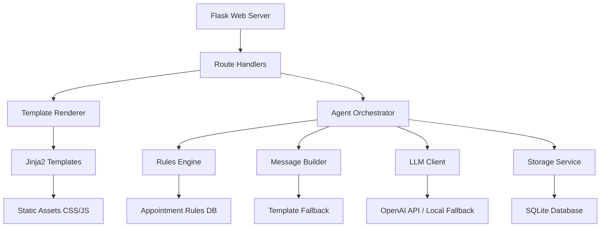
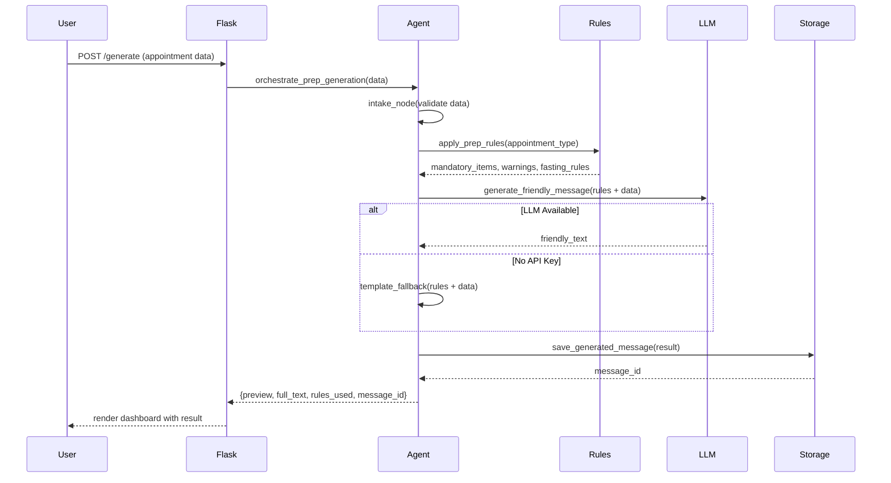
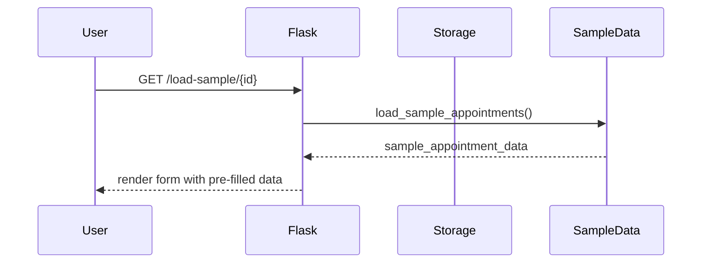

# Design Document: Appointment Prep AI Agent

## Overview

The Appointment Prep AI Agent is a local-ready Flask web application that generates personalized pre-appointment instructions for patients. The system combines a deterministic rules engine with optional AI-powered message generation to create safe, accurate, and friendly appointment preparation instructions. The application runs entirely locally with SQLite persistence, requires no cloud services, and provides a premium medical UI experience. The agent architecture uses a hybrid approach: rule-based logic determines all medical requirements (fasting, items to bring, arrival time), while the LLM (if available) only rewrites the message in a clear, friendly tone without inventing medical instructions.

## Architecture




## Sequence Diagrams

### Main Flow: Generate Appointment Prep Message



### Sample Data Loading Flow




## Components and Interfaces

### Component 1: Flask Application (app.py)

**Purpose**: Main application entry point, route handlers, template rendering

**Interface**:
```python
from flask import Flask, render_template, request, jsonify

app = Flask(__name__)

@app.route('/')
def index() -> str:
    """Render landing page"""
    pass

@app.route('/dashboard')
def dashboard() -> str:
    """Render main appointment prep dashboard"""
    pass

@app.route('/generate', methods=['POST'])
def generate_prep_message() -> dict:
    """Generate appointment prep instructions"""
    pass

@app.route('/save', methods=['POST'])
def save_message() -> dict:
    """Save generated message to SQLite"""
    pass

@app.route('/history')
def get_history() -> dict:
    """Retrieve saved messages"""
    pass

@app.route('/load-sample/<int:sample_id>')
def load_sample(sample_id: int) -> dict:
    """Load sample appointment data"""
    pass
```

**Responsibilities**:
- HTTP request/response handling
- Template rendering with Jinja2
- JSON API endpoints for AJAX calls
- Configuration loading from .env
- Database initialization on startup


### Component 2: Rules Engine (services/rules_engine.py)

**Purpose**: Deterministic rule-based logic for medical appointment preparation requirements

**Interface**:
```python
from typing import Dict, List
from dataclasses import dataclass

@dataclass
class PrepRules:
    fasting_required: bool
    fasting_hours: int
    items_to_bring: List[str]
    arrival_minutes_early: int
    medication_instructions: str
    requires_responsible_adult: bool
    special_warnings: List[str]
    category: str

class RulesEngine:
    def apply_rules(self, appointment_type: str, procedure: str) -> PrepRules:
        """Apply deterministic rules based on appointment type"""
        pass
    
    def validate_appointment_data(self, data: Dict) -> tuple[bool, List[str]]:
        """Validate required fields and return (is_valid, errors)"""
        pass
    
    def get_mandatory_items(self, appointment_type: str) -> List[str]:
        """Get mandatory items for appointment type"""
        pass
    
    def requires_fasting(self, procedure: str) -> tuple[bool, int]:
        """Check if fasting required and return (required, hours)"""
        pass
```

**Responsibilities**:
- Map appointment types to preparation requirements
- Enforce safety-critical rules (no AI invention)
- Validate appointment data completeness
- Provide structured rule outputs for message generation


### Component 3: Message Builder (services/message_builder.py)

**Purpose**: Generate human-friendly appointment prep messages from structured rules

**Interface**:
```python
from typing import Dict
from services.rules_engine import PrepRules

class MessageBuilder:
    def build_preview(self, appointment_data: Dict, rules: PrepRules) -> str:
        """Generate short preview card text (2-3 sentences)"""
        pass
    
    def build_full_message(self, appointment_data: Dict, rules: PrepRules, 
                          use_llm: bool = True) -> str:
        """Generate complete appointment prep instructions"""
        pass
    
    def build_template_message(self, appointment_data: Dict, rules: PrepRules) -> str:
        """Fallback template-based message (no LLM)"""
        pass
    
    def format_rules_explanation(self, rules: PrepRules) -> List[Dict]:
        """Format rules as structured explanation list"""
        pass
```

**Responsibilities**:
- Coordinate between template fallback and LLM generation
- Structure message sections (greeting, instructions, items, warnings)
- Format rules into human-readable explanations
- Ensure consistent message structure


### Component 4: LLM Client (services/llm_client.py)

**Purpose**: Interface to OpenAI API with graceful fallback

**Interface**:
```python
from typing import Optional

class LLMClient:
    def __init__(self, api_key: Optional[str] = None):
        self.api_key = api_key
        self.available = api_key is not None
    
    def rewrite_message(self, structured_content: str, tone: str = "friendly") -> Optional[str]:
        """Rewrite structured content in friendly tone"""
        pass
    
    def is_available(self) -> bool:
        """Check if LLM is available"""
        pass
    
    def generate_with_prompt(self, system_prompt: str, user_content: str) -> Optional[str]:
        """Generate text with custom prompt"""
        pass
```

**Responsibilities**:
- Manage OpenAI API connection
- Handle API errors gracefully
- Return None on failure (trigger fallback)
- Enforce system prompts that prevent medical invention


### Component 5: Storage Service (services/storage.py)

**Purpose**: SQLite persistence for generated messages and history

**Interface**:
```python
from typing import List, Dict, Optional
from datetime import datetime

class StorageService:
    def __init__(self, db_path: str = "data/appointments.db"):
        self.db_path = db_path
    
    def init_db(self) -> None:
        """Initialize SQLite schema"""
        pass
    
    def save_message(self, appointment_data: Dict, generated_text: str, 
                    rules_used: Dict) -> int:
        """Save generated message and return message_id"""
        pass
    
    def get_message(self, message_id: int) -> Optional[Dict]:
        """Retrieve saved message by ID"""
        pass
    
    def get_history(self, limit: int = 20) -> List[Dict]:
        """Get recent message history"""
        pass
    
    def delete_message(self, message_id: int) -> bool:
        """Delete message by ID"""
        pass
```

**Responsibilities**:
- SQLite database initialization
- CRUD operations for generated messages
- Query history with pagination
- Store appointment metadata and generated content


### Component 6: Agent Orchestrator (agent/graph.py - Optional LangGraph)

**Purpose**: Orchestrate the multi-step agent flow for message generation

**Interface**:
```python
from typing import Dict, TypedDict
from langgraph.graph import StateGraph, END

class AgentState(TypedDict):
    appointment_data: Dict
    validated: bool
    rules: Dict
    draft_message: str
    preview: str
    rules_explanation: List[Dict]
    errors: List[str]

class AppointmentPrepAgent:
    def __init__(self, rules_engine, message_builder, llm_client, storage):
        self.rules_engine = rules_engine
        self.message_builder = message_builder
        self.llm_client = llm_client
        self.storage = storage
        self.graph = self._build_graph()
    
    def _build_graph(self) -> StateGraph:
        """Build LangGraph workflow"""
        pass
    
    def intake_node(self, state: AgentState) -> AgentState:
        """Validate and normalize appointment data"""
        pass
    
    def rules_node(self, state: AgentState) -> AgentState:
        """Apply deterministic prep rules"""
        pass
    
    def draft_node(self, state: AgentState) -> AgentState:
        """Generate friendly instruction text"""
        pass
    
    def review_node(self, state: AgentState) -> AgentState:
        """Format preview and explanations"""
        pass
    
    def persist_node(self, state: AgentState) -> AgentState:
        """Save generated result locally"""
        pass
    
    def run(self, appointment_data: Dict) -> Dict:
        """Execute agent workflow and return result"""
        pass
```

**Responsibilities**:
- Define agent workflow graph (intake → rules → draft → review → persist)
- Manage state transitions between nodes
- Handle errors at each step
- Provide simple fallback if LangGraph not used


## Data Models

### AppointmentData

```python
from dataclasses import dataclass
from datetime import datetime
from typing import Optional

@dataclass
class AppointmentData:
    patient_name: str
    appointment_type: str  # e.g., "Surgery", "Consultation", "Imaging"
    procedure: str  # e.g., "Colonoscopy", "MRI", "Blood Work"
    clinician_name: str
    appointment_datetime: datetime
    channel_preference: str  # "email", "sms", "print"
    fasting_requirement: Optional[str]  # User override
    items_to_bring: Optional[str]  # User override
    special_notes: Optional[str]
```

**Validation Rules**:
- patient_name: non-empty string, max 100 chars
- appointment_type: must be in predefined list
- procedure: non-empty string, max 200 chars
- clinician_name: non-empty string, max 100 chars
- appointment_datetime: must be future date
- channel_preference: must be "email", "sms", or "print"

### GeneratedMessage

```python
@dataclass
class GeneratedMessage:
    message_id: int
    appointment_data: AppointmentData
    preview_text: str
    full_message: str
    rules_used: PrepRules
    rules_explanation: List[Dict]
    generated_at: datetime
    llm_used: bool
```

**Validation Rules**:
- preview_text: max 200 chars
- full_message: max 2000 chars
- generated_at: auto-set to current timestamp


### DesignTokens

```python
@dataclass
class DesignTokens:
    colors: Dict[str, str]  # primary, secondary, accent, neutral shades
    typography: Dict[str, Dict]  # font families, sizes, weights, line heights
    spacing: Dict[str, str]  # xs, sm, md, lg, xl, 2xl, 3xl
    effects: Dict[str, str]  # shadows, border-radius, transitions
```

**Validation Rules**:
- colors: must be valid hex codes
- typography sizes: must be valid CSS units (px, rem, em)
- spacing: must be valid CSS units
- effects: must be valid CSS values

### PageContent

```python
@dataclass
class PageContent:
    brand: Dict[str, str]  # name, tagline
    navigation: List[Dict]  # label, href
    hero: Dict  # headline, subheadline, cta
    metrics: List[Dict]  # value, label
    features: List[Dict]  # title, description, icon
```

**Validation Rules**:
- All text fields: non-empty strings
- navigation hrefs: valid URL paths
- metrics values: numeric or string with unit


## Algorithmic Pseudocode

### Main Processing Algorithm

```python
def orchestrate_prep_generation(appointment_data: dict) -> dict:
    """
    Main algorithm for generating appointment prep instructions.
    
    INPUT: appointment_data (dict with patient info, appointment details)
    OUTPUT: result (dict with preview, full_message, rules_explanation, message_id)
    
    PRECONDITIONS:
    - appointment_data contains required fields: patient_name, appointment_type, 
      procedure, clinician_name, appointment_datetime
    - appointment_datetime is a valid future datetime
    - appointment_type is in predefined valid types
    
    POSTCONDITIONS:
    - Returns complete result dict with all required fields
    - Generated message contains no invented medical instructions
    - Result is persisted to SQLite database
    - If LLM fails, template fallback is used
    
    LOOP INVARIANTS: N/A (no loops in main flow)
    """
    # Step 1: Validate input data
    is_valid, errors = rules_engine.validate_appointment_data(appointment_data)
    if not is_valid:
        return {"error": True, "messages": errors}
    
    # Step 2: Apply deterministic rules
    rules = rules_engine.apply_rules(
        appointment_data["appointment_type"],
        appointment_data["procedure"]
    )
    
    # Step 3: Generate message (LLM or template fallback)
    if llm_client.is_available():
        full_message = message_builder.build_full_message(
            appointment_data, rules, use_llm=True
        )
    else:
        full_message = message_builder.build_template_message(
            appointment_data, rules
        )
    
    # Step 4: Generate preview and explanations
    preview = message_builder.build_preview(appointment_data, rules)
    rules_explanation = message_builder.format_rules_explanation(rules)
    
    # Step 5: Persist to database
    message_id = storage.save_message(
        appointment_data, full_message, rules.__dict__
    )
    
    # Step 6: Return complete result
    return {
        "preview": preview,
        "full_message": full_message,
        "rules_explanation": rules_explanation,
        "message_id": message_id,
        "llm_used": llm_client.is_available()
    }
```


### Rules Application Algorithm

```python
def apply_rules(appointment_type: str, procedure: str) -> PrepRules:
    """
    Apply deterministic rules based on appointment type and procedure.
    
    INPUT: appointment_type (str), procedure (str)
    OUTPUT: PrepRules object with all preparation requirements
    
    PRECONDITIONS:
    - appointment_type is non-empty string
    - procedure is non-empty string
    
    POSTCONDITIONS:
    - Returns PrepRules with all fields populated
    - fasting_hours is 0 if fasting_required is False
    - items_to_bring contains at least ["Photo ID", "Insurance Card"]
    - arrival_minutes_early is between 15 and 60
    
    LOOP INVARIANTS:
    - All items in items_to_bring list are non-empty strings
    - All warnings in special_warnings list are non-empty strings
    """
    # Initialize default rules
    rules = PrepRules(
        fasting_required=False,
        fasting_hours=0,
        items_to_bring=["Photo ID", "Insurance Card"],
        arrival_minutes_early=15,
        medication_instructions="Take regular medications unless instructed otherwise",
        requires_responsible_adult=False,
        special_warnings=[],
        category="general"
    )
    
    # Normalize inputs
    apt_type_lower = appointment_type.lower()
    proc_lower = procedure.lower()
    
    # Apply surgery rules
    if apt_type_lower == "surgery" or "surgery" in proc_lower:
        rules.fasting_required = True
        rules.fasting_hours = 8
        rules.arrival_minutes_early = 60
        rules.requires_responsible_adult = True
        rules.items_to_bring.extend([
            "List of current medications",
            "Completed pre-op forms"
        ])
        rules.special_warnings.append(
            "Do not drive yourself home after surgery"
        )
        rules.category = "surgery"
    
    # Apply endoscopy/colonoscopy rules
    elif "colonoscopy" in proc_lower or "endoscopy" in proc_lower:
        rules.fasting_required = True
        rules.fasting_hours = 12
        rules.arrival_minutes_early = 30
        rules.requires_responsible_adult = True
        rules.items_to_bring.append("Prep kit instructions")
        rules.special_warnings.append(
            "Complete bowel prep as instructed"
        )
        rules.category = "endoscopy"
    
    # Apply imaging rules
    elif apt_type_lower == "imaging" or any(
        img in proc_lower for img in ["mri", "ct", "x-ray", "ultrasound"]
    ):
        rules.arrival_minutes_early = 15
        if "contrast" in proc_lower:
            rules.fasting_required = True
            rules.fasting_hours = 4
            rules.special_warnings.append(
                "Inform technician of any allergies"
            )
        rules.category = "imaging"
    
    # Apply lab work rules
    elif "blood" in proc_lower or "lab" in proc_lower:
        if "fasting" in proc_lower:
            rules.fasting_required = True
            rules.fasting_hours = 8
        rules.arrival_minutes_early = 10
        rules.category = "lab"
    
    # Default consultation rules
    else:
        rules.category = "consultation"
        rules.items_to_bring.append("List of current medications")
    
    return rules
```


### Message Generation Algorithm

```python
def build_full_message(appointment_data: dict, rules: PrepRules, use_llm: bool = True) -> str:
    """
    Generate complete appointment prep instructions.
    
    INPUT: appointment_data (dict), rules (PrepRules), use_llm (bool)
    OUTPUT: full_message (str) - complete formatted message
    
    PRECONDITIONS:
    - appointment_data contains all required fields
    - rules is valid PrepRules object
    - If use_llm is True, llm_client must be available
    
    POSTCONDITIONS:
    - Returns non-empty string message
    - Message contains all mandatory sections: greeting, appointment details,
      preparation instructions, items to bring, arrival time
    - Message length is between 200 and 2000 characters
    - No medical instructions are invented beyond rules
    
    LOOP INVARIANTS:
    - All sections in message_sections list are non-empty strings
    """
    # Build structured content from rules
    structured_content = []
    
    # Section 1: Greeting
    greeting = f"Dear {appointment_data['patient_name']},"
    structured_content.append(greeting)
    
    # Section 2: Appointment details
    apt_details = (
        f"This is a reminder about your {appointment_data['appointment_type']} "
        f"appointment for {appointment_data['procedure']} with "
        f"Dr. {appointment_data['clinician_name']} on "
        f"{appointment_data['appointment_datetime'].strftime('%B %d, %Y at %I:%M %p')}."
    )
    structured_content.append(apt_details)
    
    # Section 3: Fasting instructions (if required)
    if rules.fasting_required:
        fasting_text = (
            f"IMPORTANT: Please do not eat or drink anything for "
            f"{rules.fasting_hours} hours before your appointment. "
            f"This means no food or beverages after "
            f"{calculate_fasting_start_time(appointment_data['appointment_datetime'], rules.fasting_hours)}."
        )
        structured_content.append(fasting_text)
    
    # Section 4: Items to bring
    items_text = "Please bring the following items:\n"
    for item in rules.items_to_bring:
        items_text += f"- {item}\n"
    structured_content.append(items_text)
    
    # Section 5: Arrival time
    arrival_text = (
        f"Please arrive {rules.arrival_minutes_early} minutes early "
        f"to complete any necessary paperwork."
    )
    structured_content.append(arrival_text)
    
    # Section 6: Medication instructions
    structured_content.append(rules.medication_instructions)
    
    # Section 7: Responsible adult (if required)
    if rules.requires_responsible_adult:
        adult_text = (
            "You will need a responsible adult to drive you home after "
            "the procedure. Please arrange for transportation in advance."
        )
        structured_content.append(adult_text)
    
    # Section 8: Special warnings
    for warning in rules.special_warnings:
        structured_content.append(f"IMPORTANT: {warning}")
    
    # Section 9: Closing
    closing = (
        "If you have any questions or need to reschedule, please contact "
        "our office. We look forward to seeing you."
    )
    structured_content.append(closing)
    
    # Join all sections
    base_message = "\n\n".join(structured_content)
    
    # Use LLM to rewrite in friendly tone (if available)
    if use_llm and llm_client.is_available():
        system_prompt = (
            "You are a medical office assistant. Rewrite the following "
            "appointment preparation instructions in a warm, friendly, and "
            "clear tone. DO NOT add, remove, or modify any medical instructions, "
            "requirements, or warnings. Only improve the wording and flow. "
            "Keep all specific times, items, and requirements exactly as stated."
        )
        
        friendly_message = llm_client.generate_with_prompt(
            system_prompt, base_message
        )
        
        if friendly_message:
            return friendly_message
    
    # Fallback: return structured message as-is
    return base_message
```


### Validation Algorithm

```python
def validate_appointment_data(data: dict) -> tuple[bool, list[str]]:
    """
    Validate appointment data completeness and correctness.
    
    INPUT: data (dict) - appointment data to validate
    OUTPUT: (is_valid, errors) - tuple of bool and list of error messages
    
    PRECONDITIONS:
    - data is a dictionary (may be empty or incomplete)
    
    POSTCONDITIONS:
    - Returns (True, []) if all validations pass
    - Returns (False, error_list) if any validation fails
    - error_list contains descriptive error messages
    - No side effects on input data
    
    LOOP INVARIANTS:
    - All errors in errors list are non-empty strings
    - Each validation adds at most one error message
    """
    errors = []
    
    # Required fields validation
    required_fields = [
        "patient_name",
        "appointment_type",
        "procedure",
        "clinician_name",
        "appointment_datetime",
        "channel_preference"
    ]
    
    for field in required_fields:
        if field not in data or not data[field]:
            errors.append(f"Missing required field: {field}")
    
    # Early return if required fields missing
    if errors:
        return (False, errors)
    
    # Patient name validation
    if len(data["patient_name"]) > 100:
        errors.append("Patient name must be 100 characters or less")
    
    # Appointment type validation
    valid_types = ["Surgery", "Consultation", "Imaging", "Lab Work", "Procedure"]
    if data["appointment_type"] not in valid_types:
        errors.append(
            f"Invalid appointment type. Must be one of: {', '.join(valid_types)}"
        )
    
    # Procedure validation
    if len(data["procedure"]) > 200:
        errors.append("Procedure description must be 200 characters or less")
    
    # Clinician name validation
    if len(data["clinician_name"]) > 100:
        errors.append("Clinician name must be 100 characters or less")
    
    # Appointment datetime validation
    try:
        apt_dt = datetime.fromisoformat(data["appointment_datetime"])
        if apt_dt <= datetime.now():
            errors.append("Appointment date must be in the future")
    except (ValueError, TypeError):
        errors.append("Invalid appointment datetime format")
    
    # Channel preference validation
    valid_channels = ["email", "sms", "print"]
    if data["channel_preference"] not in valid_channels:
        errors.append(
            f"Invalid channel preference. Must be one of: {', '.join(valid_channels)}"
        )
    
    # Return validation result
    is_valid = len(errors) == 0
    return (is_valid, errors)
```


## Key Functions with Formal Specifications

### Function 1: orchestrate_prep_generation()

```python
def orchestrate_prep_generation(appointment_data: dict) -> dict:
    """Main orchestration function for generating appointment prep instructions."""
    pass
```

**Preconditions:**
- `appointment_data` is a non-null dictionary
- `appointment_data` contains keys: patient_name, appointment_type, procedure, clinician_name, appointment_datetime, channel_preference
- `appointment_datetime` is a valid ISO format datetime string representing a future date
- All service dependencies (rules_engine, message_builder, llm_client, storage) are initialized

**Postconditions:**
- Returns dictionary with keys: preview, full_message, rules_explanation, message_id, llm_used
- If validation fails, returns dictionary with key "error": True and "messages": list of errors
- Generated message is persisted to SQLite database
- `full_message` contains no medical instructions beyond those determined by rules_engine
- `message_id` is a positive integer representing the saved record

**Loop Invariants:** N/A (no loops)

### Function 2: apply_rules()

```python
def apply_rules(appointment_type: str, procedure: str) -> PrepRules:
    """Apply deterministic preparation rules based on appointment type."""
    pass
```

**Preconditions:**
- `appointment_type` is a non-empty string
- `procedure` is a non-empty string

**Postconditions:**
- Returns PrepRules object with all fields populated
- `fasting_hours` is 0 if and only if `fasting_required` is False
- `items_to_bring` list contains at least ["Photo ID", "Insurance Card"]
- `arrival_minutes_early` is between 10 and 60 (inclusive)
- `category` is one of: "surgery", "endoscopy", "imaging", "lab", "consultation"
- No field in returned PrepRules is None

**Loop Invariants:**
- For loops iterating over items_to_bring: all previously added items are non-empty strings
- For loops iterating over special_warnings: all previously added warnings are non-empty strings


### Function 3: build_full_message()

```python
def build_full_message(appointment_data: dict, rules: PrepRules, use_llm: bool = True) -> str:
    """Generate complete appointment prep message."""
    pass
```

**Preconditions:**
- `appointment_data` is a valid dictionary with all required fields
- `rules` is a valid PrepRules object with all fields populated
- If `use_llm` is True, llm_client is initialized (may or may not be available)

**Postconditions:**
- Returns non-empty string
- Message length is between 200 and 2000 characters
- Message contains all mandatory sections: greeting, appointment details, preparation instructions
- If `rules.fasting_required` is True, message includes fasting instructions
- If `rules.requires_responsible_adult` is True, message includes transportation warning
- All items in `rules.items_to_bring` are included in message
- All warnings in `rules.special_warnings` are included in message
- No medical instructions are added beyond those in `rules`

**Loop Invariants:**
- For loop building items_to_bring section: all previously processed items are included in items_text
- For loop building special_warnings section: all previously processed warnings are included in message

### Function 4: validate_appointment_data()

```python
def validate_appointment_data(data: dict) -> tuple[bool, list[str]]:
    """Validate appointment data completeness and correctness."""
    pass
```

**Preconditions:**
- `data` is a dictionary (may be empty, incomplete, or contain invalid values)

**Postconditions:**
- Returns tuple of (bool, list[str])
- First element is True if and only if all validations pass
- Second element is empty list if and only if first element is True
- Each error message in second element is a non-empty descriptive string
- No mutations to input `data` dictionary

**Loop Invariants:**
- For loop checking required fields: all previously checked missing fields have been added to errors list
- For loop checking field lengths: all previously checked invalid fields have been added to errors list


### Function 5: save_message()

```python
def save_message(appointment_data: dict, generated_text: str, rules_used: dict) -> int:
    """Save generated message to SQLite database."""
    pass
```

**Preconditions:**
- `appointment_data` is a valid dictionary with all required fields
- `generated_text` is a non-empty string
- `rules_used` is a dictionary representation of PrepRules
- SQLite database is initialized and accessible

**Postconditions:**
- Returns positive integer message_id
- Record is persisted to SQLite database
- Record contains all input data plus auto-generated timestamp
- Database transaction is committed successfully
- If database error occurs, raises exception (does not return invalid ID)

**Loop Invariants:** N/A (no loops)

### Function 6: rewrite_message()

```python
def rewrite_message(structured_content: str, tone: str = "friendly") -> Optional[str]:
    """Rewrite structured content using LLM in specified tone."""
    pass
```

**Preconditions:**
- `structured_content` is a non-empty string
- `tone` is one of: "friendly", "formal", "concise"
- LLM client is initialized (API key may or may not be present)

**Postconditions:**
- Returns non-empty string if LLM is available and call succeeds
- Returns None if LLM is unavailable or call fails
- If return value is not None, it contains reworded version of structured_content
- Returned message preserves all medical instructions from structured_content
- No side effects on input parameters

**Loop Invariants:** N/A (no loops)


## Example Usage

### Example 1: Basic Appointment Prep Generation

```python
from flask import Flask, request, jsonify
from services.rules_engine import RulesEngine
from services.message_builder import MessageBuilder
from services.llm_client import LLMClient
from services.storage import StorageService

# Initialize services
rules_engine = RulesEngine()
llm_client = LLMClient(api_key=os.getenv("OPENAI_API_KEY"))
message_builder = MessageBuilder(llm_client)
storage = StorageService()

# Sample appointment data
appointment_data = {
    "patient_name": "John Smith",
    "appointment_type": "Surgery",
    "procedure": "Colonoscopy",
    "clinician_name": "Dr. Sarah Johnson",
    "appointment_datetime": "2024-02-15T09:00:00",
    "channel_preference": "email",
    "special_notes": "Patient has latex allergy"
}

# Generate prep message
result = orchestrate_prep_generation(appointment_data)

# Result contains:
# {
#   "preview": "Your colonoscopy with Dr. Johnson is on Feb 15 at 9:00 AM...",
#   "full_message": "Dear John Smith,\n\nThis is a reminder...",
#   "rules_explanation": [
#     {"rule": "Fasting Required", "reason": "12 hours before procedure"},
#     {"rule": "Responsible Adult", "reason": "Sedation will be used"}
#   ],
#   "message_id": 42,
#   "llm_used": True
# }
```

### Example 2: Template Fallback (No LLM)

```python
# Initialize without API key
llm_client = LLMClient(api_key=None)
message_builder = MessageBuilder(llm_client)

# Generate message - will use template fallback
result = orchestrate_prep_generation(appointment_data)

# Result will have llm_used: False
# Message will be structured but not AI-reworded
```


### Example 3: Flask Route Handler

```python
@app.route('/generate', methods=['POST'])
def generate_prep_message():
    """Generate appointment prep instructions via AJAX."""
    try:
        # Parse request data
        appointment_data = request.get_json()
        
        # Validate and generate
        result = orchestrate_prep_generation(appointment_data)
        
        # Check for validation errors
        if result.get("error"):
            return jsonify(result), 400
        
        # Return success
        return jsonify(result), 200
        
    except Exception as e:
        return jsonify({
            "error": True,
            "messages": [f"Server error: {str(e)}"]
        }), 500
```

### Example 4: Loading Sample Data

```python
import json

def load_sample_appointments():
    """Load sample appointment data from JSON file."""
    with open('data/sample_appointments.json', 'r') as f:
        samples = json.load(f)
    return samples

@app.route('/load-sample/<int:sample_id>')
def load_sample(sample_id):
    """Load a specific sample appointment."""
    samples = load_sample_appointments()
    
    if 0 <= sample_id < len(samples):
        return jsonify(samples[sample_id])
    else:
        return jsonify({"error": "Sample not found"}), 404
```

### Example 5: LangGraph Agent (Optional)

```python
from langgraph.graph import StateGraph, END

def build_agent_graph():
    """Build LangGraph workflow for appointment prep generation."""
    workflow = StateGraph(AgentState)
    
    # Add nodes
    workflow.add_node("intake", intake_node)
    workflow.add_node("rules", rules_node)
    workflow.add_node("draft", draft_node)
    workflow.add_node("review", review_node)
    workflow.add_node("persist", persist_node)
    
    # Add edges
    workflow.set_entry_point("intake")
    workflow.add_edge("intake", "rules")
    workflow.add_edge("rules", "draft")
    workflow.add_edge("draft", "review")
    workflow.add_edge("review", "persist")
    workflow.add_edge("persist", END)
    
    return workflow.compile()

# Use the agent
agent = build_agent_graph()
result = agent.invoke({"appointment_data": appointment_data})
```


## Correctness Properties

*A property is a characteristic or behavior that should hold true across all valid executions of a system-essentially, a formal statement about what the system should do. Properties serve as the bridge between human-readable specifications and machine-verifiable correctness guarantees.*

### Property 1: No Invented Medical Instructions
**Universal Quantification:**
∀ appointment_data, generated_message: 
  generated_message = generate(appointment_data) ⟹ 
  all_medical_instructions(generated_message) ⊆ rules_engine.apply_rules(appointment_data)

**Meaning:** Every medical instruction in the generated message must come from the deterministic rules engine, not invented by the LLM.

**Validates: Requirements 2.1, 2.2, 2.3, 2.4, 2.5, 2.6, 3.11, 4.7, 4.8**

### Property 2: Required Fields Validation
**Universal Quantification:**
∀ data: 
  validate_appointment_data(data) = (True, []) ⟹ 
  (data.patient_name ≠ ∅ ∧ data.appointment_type ≠ ∅ ∧ 
   data.procedure ≠ ∅ ∧ data.clinician_name ≠ ∅ ∧ 
   data.appointment_datetime > now())

**Meaning:** If validation passes, all required fields must be present and appointment must be in the future.

**Validates: Requirements 1.1, 1.3, 1.6, 1.7, 1.8, 1.10**

### Property 3: Fasting Rules Consistency
**Universal Quantification:**
∀ rules: PrepRules:
  rules.fasting_required = False ⟹ rules.fasting_hours = 0 ∧
  rules.fasting_required = True ⟹ rules.fasting_hours > 0

**Meaning:** Fasting hours must be zero if fasting is not required, and positive if fasting is required.

**Validates: Requirements 2.8, 2.9**

### Property 4: Message Completeness
**Universal Quantification:**
∀ appointment_data, rules, message:
  message = build_full_message(appointment_data, rules) ⟹
  (contains_greeting(message) ∧ contains_appointment_details(message) ∧
   contains_items_to_bring(message) ∧ contains_arrival_time(message) ∧
   (rules.fasting_required ⟹ contains_fasting_instructions(message)) ∧
   (rules.requires_responsible_adult ⟹ contains_transportation_warning(message)))

**Meaning:** Generated message must contain all mandatory sections and conditional sections based on rules.

**Validates: Requirements 3.1, 3.2, 3.3, 3.4, 3.5, 3.6, 3.7, 3.8, 3.9**


### Property 5: Database Persistence
**Universal Quantification:**
∀ appointment_data, message, rules:
  message_id = save_message(appointment_data, message, rules) ⟹
  (message_id > 0 ∧ get_message(message_id) ≠ None ∧
   get_message(message_id).full_message = message)

**Meaning:** Saved messages must return valid IDs and be retrievable with matching content.

**Validates: Requirements 5.3, 5.5**

### Property 6: LLM Fallback Safety
**Universal Quantification:**
∀ appointment_data, rules:
  ¬llm_client.is_available() ⟹
  build_full_message(appointment_data, rules, use_llm=True) = 
  build_template_message(appointment_data, rules)

**Meaning:** When LLM is unavailable, the system must fall back to template-based generation.

**Validates: Requirements 4.3, 4.5, 4.6**

### Property 7: Validation Error Completeness
**Universal Quantification:**
∀ data:
  validate_appointment_data(data) = (False, errors) ⟹
  (errors ≠ [] ∧ ∀ error ∈ errors: error ≠ ∅)

**Meaning:** If validation fails, error list must be non-empty with descriptive messages.

**Validates: Requirements 1.9**

### Property 8: Rules Category Assignment
**Universal Quantification:**
∀ appointment_type, procedure:
  rules = apply_rules(appointment_type, procedure) ⟹
  rules.category ∈ {"surgery", "endoscopy", "imaging", "lab", "consultation"}

**Meaning:** Every rule application must assign a valid category.

**Validates: Requirements 2.10**


## Error Handling

### Error Scenario 1: Missing Required Fields

**Condition:** User submits form with missing required fields (patient_name, appointment_type, etc.)

**Response:** 
- validate_appointment_data() returns (False, error_list)
- Flask route returns 400 Bad Request with JSON error messages
- Frontend displays error messages in red alert box above form
- Form fields with errors are highlighted with red border

**Recovery:**
- User corrects missing fields
- Form validation runs on blur for each field
- User can resubmit when all fields are valid

### Error Scenario 2: LLM API Failure

**Condition:** OpenAI API call fails (network error, rate limit, invalid key)

**Response:**
- llm_client.rewrite_message() catches exception and returns None
- message_builder.build_full_message() detects None and falls back to template
- System logs warning but continues execution
- Generated message uses template-based formatting

**Recovery:**
- System automatically uses template fallback
- User sees generated message (template version)
- No user action required
- Admin can check logs and fix API key if needed

### Error Scenario 3: Database Write Failure

**Condition:** SQLite database is locked, disk full, or permissions error

**Response:**
- storage.save_message() raises exception
- Flask route catches exception and returns 500 Internal Server Error
- Frontend displays error: "Failed to save message. Please try again."
- Generated message is still displayed (not lost)

**Recovery:**
- User can copy message text manually
- User can retry save operation
- Admin investigates database issue
- System provides "Copy to Clipboard" button as workaround


### Error Scenario 4: Invalid Appointment Date

**Condition:** User enters past date or invalid date format

**Response:**
- validate_appointment_data() detects past date or parse error
- Returns (False, ["Appointment date must be in the future"])
- Flask route returns 400 Bad Request
- Frontend displays error message below date input field

**Recovery:**
- User selects valid future date
- Date picker restricts selection to future dates only
- Form revalidates on date change

### Error Scenario 5: Sample Data File Missing

**Condition:** data/sample_appointments.json file not found

**Response:**
- load_sample_appointments() catches FileNotFoundError
- Returns empty list []
- Frontend displays message: "No sample data available"
- Sample data buttons are disabled

**Recovery:**
- Admin restores sample_appointments.json file
- User can still use manual form entry
- App remains functional without samples

### Error Scenario 6: Database Schema Not Initialized

**Condition:** SQLite database file doesn't exist or schema not created

**Response:**
- storage.init_db() is called on app startup
- Creates database file and schema automatically
- If creation fails, app logs error and exits with clear message

**Recovery:**
- Check file permissions in data/ directory
- Ensure data/ directory exists
- Run app.py again after fixing permissions


## Testing Strategy

### Unit Testing Approach

**Test Coverage Goals:**
- 90%+ code coverage for services layer
- 100% coverage for rules_engine (safety-critical)
- All edge cases for validation logic

**Key Test Cases:**

1. **Rules Engine Tests** (test_rules_engine.py)
   - Test each appointment type category (surgery, endoscopy, imaging, lab, consultation)
   - Test fasting rules for different procedures
   - Test mandatory items list generation
   - Test arrival time calculation
   - Test responsible adult requirement logic
   - Test special warnings generation

2. **Validation Tests** (test_validation.py)
   - Test missing required fields
   - Test invalid date formats
   - Test past dates rejection
   - Test field length limits
   - Test invalid appointment types
   - Test invalid channel preferences

3. **Message Builder Tests** (test_message_builder.py)
   - Test preview generation
   - Test full message structure
   - Test template fallback
   - Test section inclusion based on rules
   - Test message length constraints
   - Test special character handling

4. **Storage Tests** (test_storage.py)
   - Test database initialization
   - Test message save and retrieve
   - Test history retrieval with pagination
   - Test message deletion
   - Test concurrent access handling

5. **LLM Client Tests** (test_llm_client.py)
   - Test API availability check
   - Test successful API call
   - Test API failure handling
   - Test None return on error
   - Mock OpenAI API responses


### Property-Based Testing Approach

**Property Test Library:** Hypothesis (Python)

**Property Tests:**

1. **Property: No Medical Instruction Invention**
   ```python
   @given(st.text(), st.text())
   def test_no_invented_instructions(appointment_type, procedure):
       rules = rules_engine.apply_rules(appointment_type, procedure)
       message = message_builder.build_template_message(sample_data, rules)
       
       # Extract all medical instructions from message
       instructions = extract_medical_instructions(message)
       
       # Verify all instructions come from rules
       for instruction in instructions:
           assert instruction_in_rules(instruction, rules)
   ```

2. **Property: Validation Idempotence**
   ```python
   @given(st.dictionaries(st.text(), st.text()))
   def test_validation_idempotent(data):
       result1 = validate_appointment_data(data)
       result2 = validate_appointment_data(data)
       assert result1 == result2  # Same input always gives same result
   ```

3. **Property: Message Completeness**
   ```python
   @given(st.text(), st.text())
   def test_message_contains_all_sections(appointment_type, procedure):
       rules = rules_engine.apply_rules(appointment_type, procedure)
       message = message_builder.build_full_message(sample_data, rules)
       
       assert contains_greeting(message)
       assert contains_appointment_details(message)
       assert contains_items_to_bring(message)
       
       if rules.fasting_required:
           assert contains_fasting_instructions(message)
   ```

4. **Property: Fasting Rules Consistency**
   ```python
   @given(st.text(), st.text())
   def test_fasting_consistency(appointment_type, procedure):
       rules = rules_engine.apply_rules(appointment_type, procedure)
       
       if rules.fasting_required:
           assert rules.fasting_hours > 0
       else:
           assert rules.fasting_hours == 0
   ```


### Integration Testing Approach

**Integration Test Scenarios:**

1. **End-to-End Flow Test**
   - Start Flask test client
   - POST to /generate with valid appointment data
   - Verify 200 response with all expected fields
   - Verify message saved to database
   - GET /history and verify message appears
   - Verify message content matches rules

2. **LLM Fallback Integration Test**
   - Initialize app without OPENAI_API_KEY
   - POST to /generate
   - Verify template fallback is used
   - Verify llm_used flag is False
   - Verify message quality is acceptable

3. **Sample Data Loading Test**
   - GET /load-sample/0
   - Verify sample data returned
   - POST sample data to /generate
   - Verify successful generation

4. **Database Persistence Test**
   - Generate multiple messages
   - Restart app (simulate server restart)
   - Verify all messages still in database
   - Verify history retrieval works

5. **Frontend-Backend Integration Test**
   - Use Selenium or Playwright
   - Fill out form in browser
   - Click "Generate" button
   - Verify AJAX call succeeds
   - Verify message appears in UI
   - Click "Copy" button
   - Verify clipboard contains message

**Test Environment:**
- Use pytest for test runner
- Use pytest-flask for Flask testing
- Use pytest-mock for mocking
- Use hypothesis for property-based tests
- Use SQLite in-memory database for tests
- Mock OpenAI API calls in tests


## Performance Considerations

### Response Time Requirements
- Form submission to message display: < 2 seconds (with LLM)
- Form submission to message display: < 500ms (template fallback)
- Sample data loading: < 100ms
- History retrieval: < 200ms for 20 records

### Optimization Strategies

1. **LLM Call Optimization**
   - Set reasonable timeout (5 seconds) for OpenAI API
   - Use streaming if available for faster perceived response
   - Cache common message patterns (future enhancement)
   - Implement request queuing if multiple users

2. **Database Optimization**
   - Index on generated_at timestamp for history queries
   - Use connection pooling for concurrent requests
   - Implement pagination for large history lists
   - Regular VACUUM operations for SQLite maintenance

3. **Frontend Optimization**
   - Debounce form validation (300ms delay)
   - Show loading spinner during generation
   - Use AJAX for async message generation
   - Lazy load history panel
   - Minimize CSS/JS bundle size

4. **Template Rendering**
   - Cache Jinja2 templates in production
   - Minimize template complexity
   - Use template inheritance efficiently
   - Preload design tokens and page content

### Scalability Considerations
- Current design targets single-user local deployment
- For multi-user: add request queuing for LLM calls
- For high volume: consider Redis cache for rules
- For production: migrate to PostgreSQL from SQLite
- For cloud: add rate limiting and authentication


## Security Considerations

### Data Privacy
- All data stored locally in SQLite (no cloud transmission except OpenAI API)
- Patient names and appointment details never logged to console
- Implement .gitignore for database files and .env
- No PII in error messages or stack traces
- Clear guidance in README about HIPAA compliance limitations

### API Key Security
- Store OpenAI API key in .env file (never in code)
- Provide .env.example with placeholder
- Validate API key format before use
- Graceful fallback if key is invalid or missing
- Document key rotation procedures

### Input Validation
- Sanitize all user inputs before database insertion
- Use parameterized SQL queries (prevent SQL injection)
- Validate appointment_type against whitelist
- Limit string field lengths to prevent buffer issues
- Escape HTML in Jinja2 templates (auto-escaping enabled)

### LLM Prompt Injection Prevention
- Use system prompts that explicitly forbid medical invention
- Validate LLM output doesn't contain harmful instructions
- Never pass user input directly to LLM without structure
- Log suspicious LLM outputs for review
- Implement content filtering on LLM responses

### File System Security
- Restrict database file permissions (600)
- Validate file paths to prevent directory traversal
- Use absolute paths for data directory
- Check file existence before operations
- Handle file I/O errors gracefully

### Session Security
- No authentication required (local single-user app)
- For future multi-user: implement Flask-Login
- For future multi-user: use CSRF tokens
- For future multi-user: implement session timeouts

### Dependency Security
- Pin all dependency versions in requirements.txt
- Regularly update dependencies for security patches
- Use pip-audit to check for known vulnerabilities
- Minimize dependency count to reduce attack surface


## Dependencies

### Core Dependencies

**Flask Ecosystem:**
- `flask==3.0.0` - Web framework
- `jinja2==3.1.2` - Template engine (included with Flask)
- `werkzeug==3.0.1` - WSGI utilities (included with Flask)

**Database:**
- `sqlite3` - Built-in Python module (no install needed)

**Configuration:**
- `python-dotenv==1.0.0` - Environment variable management

**LLM Integration:**
- `openai==1.6.1` - OpenAI API client (optional)

**Agent Orchestration (Optional):**
- `langgraph==0.0.20` - Agent workflow orchestration (optional)
- `langchain==0.1.0` - LLM utilities (optional, only if using LangGraph)

**Testing:**
- `pytest==7.4.3` - Test framework
- `pytest-flask==1.3.0` - Flask testing utilities
- `pytest-mock==3.12.0` - Mocking utilities
- `hypothesis==6.92.0` - Property-based testing

**Development:**
- `black==23.12.1` - Code formatting
- `flake8==7.0.0` - Linting
- `pip-audit==2.6.1` - Security vulnerability scanning

### External Services

**OpenAI API (Optional):**
- Used for message rewriting in friendly tone
- Requires API key in .env file
- Graceful fallback to template if unavailable
- No other external services required

### System Requirements

- Python 3.11 or higher
- 100MB disk space for application
- 50MB disk space for SQLite database (grows with usage)
- Internet connection only for OpenAI API (optional)
- No Docker or containerization required
- No cloud services required

### File Structure Dependencies

```
project_root/
├── data/
│   ├── design_tokens.json (required)
│   ├── page_content.json (required)
│   ├── sample_appointments.json (required)
│   └── appointments.db (auto-created)
├── templates/ (required)
├── static/ (required)
├── services/ (required)
├── agent/ (optional if using LangGraph)
├── .env (user-created from .env.example)
└── requirements.txt (required)
```

